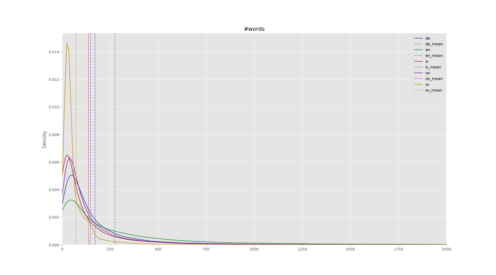
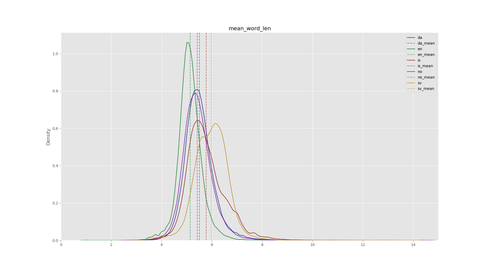

# Quality Filtering

This repository provides code to execute quality filtering to textual data. 
It primarily does 3 things:
1. Preprocess documents to a standard format
2. Filter documents of poor textual quality
3. Add metrics to the documents

## Overview

The bash script `./exec_filtering.sh` has 3 variables to select input file, output file, and config (yaml) file. The order of filters in the config file determines the order of filter execution. See _example_config.yaml_ for a config that runs all filters.

It then calls `filter_main.py` with these arguments, which parses the config file and creates a list of filters that should be applied. 

The file `read_work_write_parallel.py` is used to stream input json lines, work on these lines in parallel, and stream out processed/filtered lines. So, 2 threads will be handling I/O, and `NUM_PROCESSING_WORKERS` processes the lines, all simultaneously. 

The filter names in the yaml-config directly corresponds to a method name in the `Document` class in `Document.py`, which iterates over these names and calls the functions.

If any filter returns False, this means that the document does not meet the filter criteria, and this json line is then not written to the output file.

Each input file will generate a corresponding jsonl file with the texts, urls, keep flag, filter list, and metrics. 
Additionally, a *filtering_log* text file with the python program output is created for each file. This log will include a table of statistics of how many documents got removed for each filter.

## Clean directory subtree

`./clean_dirs.sh` contains 3 parameters:

- **CONFIG_BASE_PATH**: The path to a directory holding all the config files
- **ROOT_IN**: The absolute path to the source data directory, e.g. `/data/nordic_pile/jsonl_train_format/original`
- **ROOT_OUT**: The absolute path to the destination data directory, e.g. `/data/nordic_pile/jsonl_train_format/cleaned`

It recursively finds all .jsonl files within ROOT_IN and finds the correct config file in CONFIG_BASE_PATH through the mapping
defined in filter_main.py. Then the filters specified in this config file are used to clean the given document and writes and identical
directory/file subtree in ROOT_OUT. 

## Filters

### empty
Remove documents that are shorter than 5 characters, and skip evaluating any other filters since they can crash on empty documents.
Normalization + Metrics are still done.

*This filter is always used and is not required to add to the config file.*

### supported_language
Remove documents that are not greedily predicted, using FastText, as one of the supported languages. (en, sv, no, da, is)

### doc_length
Remove documents that are shorter than 50 characters.

### mean_word_length
Remove documents that have an average word length shorter than 2 or longer than 10 characters.

### mean_line_len
Remove documents that have a too small number of words or characters per non-empty line.

### stop_word
Remove documents with less than 2 common stop words present, or a too low fraction of stop words.

### alpha_present
Remove documents where less than 80% of the words contain no alphabetic character

### hashtag_to_word_ratio & ellipsis_to_word_ratio
Remove documents with a symbol-to-word ratio greater than 0.1, for hashtags and ellipsis respectively.

### initial_bullet_point
Remove documents where more than 90% of the lines start with a bullet point, and such lines occur at least 3 times.

### ending_ellipsis
Remove documents where more than 30% of lines end with an ellipsis, and such lines occur at least 3 times.

### blacklist_urls
Does nothing if no url is present. Otherwise, remove documents if any of these are true:
1. The url is malformed.
2. The domain is blacklisted.
3. The file extension in the url is blacklisted.
4. The entire url is blacklisted.

In the directory _blacklisted_urls_, there are three subdirectories: _domains_, _extensions_, and _full_urls_. 
Each of these contain any number of _.txt_ files that are loaded at runtime, where each line represents a blacklisted domain, extension, or url.

### repetitive
Remove documents that are repetitive in terms of lines, paragraphs, or n-grams (we do word-level n-grams instead of BPE-tokens, with some adjusted thresholds). See [Gopher](https://arxiv.org/pdf/2112.11446.pdf), pages 40-41.

### repetitive_bsp
Remove documents that are repetitive in terms of character or word n-grams. See [BigScience repo](https://github.com/bigscience-workshop/data_tooling/tree/master/ac_dc).

### smut
Remove documents that have a too high ratio of dirty words, see smut_words.txt and smutdetector.py for the list of naughty words along with their respective weights.
Should probably only be used for commoncrawl-based corpora (since those are the datasets with the most pornographic content) to avoid incorporating a bias in our datasets.

## Preprocessing

1. Whitespace normalization
2. Unicode punctuation
3. Remove non-printing characters, e.g. weird unicode **(Not Used)**
4. Unicode Normalization (NFC)

## Document Metrics

### len_char
Number of characters in the document.

### len_utf8bytes
Number of bytes in the document.

### len_words
Number of words in the document.

### len_sents
Number of sentences in the document

### lang
The language identified in the document.

### md5
The 128-bit md5 hash as a hexadecimal string.

## Other TODOs: 
- Optimize to avoid precomputing stuff that is not needed if some filters are disabled 

## Statistics to define values of the filters

**Mean_word_length**:

I took *literaturbanken*, which should be high quality books. And calculated the mean word length of each book. (I split it using the regex you showed) These are the metrics from the resulting list:
Min=3.7067423704755145, Max=6.11333714939897, Mean=4.831033042585691

**Stopwords**:

The most common words in the first 10 000 samples in mc4 

**is** [('að', 169055), ('og', 168194), ('í', 140468), ('á', 109411), ('er', 84730), ('sem', 75381), ('til', 53967), ('um', 45702), ('við', 44658), ('með', 35876), ('fyrir', 32168), ('ekki', 31090), ('en', 29595), ('-', 29462), ('var', 26606), ('af', 25903), ('það', 25325), ('því', 22712), ('eru', 21775), ('frá', 18686), ('ég', 16546), ('eða', 15283), ('hefur', 15239), ('hann', 14566), ('verið', 13032), ('hafa', 12637), ('eftir', 12544), ('þar', 12255), ('þá', 12199), ('|', 11846)] (edited)

**no** [('og', 152883), ('i', 130176), ('er', 93674), ('på', 76581), ('av', 73150), ('for', 72289), ('til', 69597), ('som', 66086), ('å', 65025), ('en', 63197), ('med', 59517), ('det', 57246), ('har', 45568), ('at', 40883), ('-', 33170), ('du', 30620), ('ikke', 28731), ('de', 28314), ('fra', 27157), ('om', 26878), ('kan', 25885), ('et', 25286), ('den', 23658), ('Det', 19789), ('jeg', 19777), ('var', 17588), ('vi', 16976), ('eller', 16088), ('så', 14820), ('skal', 13604)]

**sv** [('och', 121981), ('att', 89883), ('i', 89545), ('är', 62882), ('på', 62407), ('som', 62028), ('en', 58470), ('för', 54258), ('av', 49795), ('det', 49610), ('med', 49172), ('till', 39418), ('har', 34755), ('om', 27256), ('jag', 26313), ('inte', 25994), ('den', 25857), ('du', 25175), ('ett', 24660), ('-', 24231), ('kan', 22452), ('de', 21331), ('så', 20385), ('från', 17223), ('eller', 15693), ('vi', 15666), ('Det', 15552), ('man', 14845), ('var', 13693), ('men', 11836)]

**da** [('og', 140309), ('i', 118254), ('at', 97744), ('er', 94140), ('til', 82428), ('af', 74182), ('en', 68592), ('på', 64907), ('for', 56941), ('med', 55410), ('det', 46946), ('der', 40789), ('som', 36961), ('har', 36750), ('den', 36552), ('de', 35014), ('-', 33800), ('kan', 33375), ('du', 32525), ('et', 30255), ('ikke', 28934), ('fra', 25619), ('om', 23264), ('så', 19881), ('eller', 18062), ('Det', 16634), ('jeg', 16169), ('skal', 15956), ('vi', 15667), ('var', 14940)]

## Statistics - Wikipedia

### Most frequent words
["da", "en", "is", "no", "sv"]
All words were made to lower case before analysis.

**da:** [('i', 288300), ('og', 227849), ('af', 150054), ('en', 124326), ('er', 103208), ('til', 102407), ('at', 93941), ('den', 93776), ('som', 81743), ('på', 80492)]

**en:** [('the', 539347), ('of', 257585), ('and', 223100), ('in', 221692), ('a', 157424), ('to', 157248), ('was', 95710), ('is', 70985), ('for', 64988), ('on', 64390)]

**is:** [('og', 199239), ('í', 177258), ('að', 115670), ('á', 109302), ('er', 99268), ('sem', 94747), ('var', 71627), ('til', 58949), ('en', 42544), ('hann', 41655)]

**no:** [('i', 267883), ('og', 194480), ('av', 113947), ('som', 103077), ('en', 99020), ('er', 91134), ('til', 84642), ('på', 77803), ('ble', 68084), ('for', 65009)]

**sv:** [('i', 111279), ('och', 77116), ('är', 70937), ('av', 47718), ('en', 46064), ('som', 39122), ('den', 39020), ('med', 25962), ('på', 18707), ('till', 18256)]

### Data Plots

